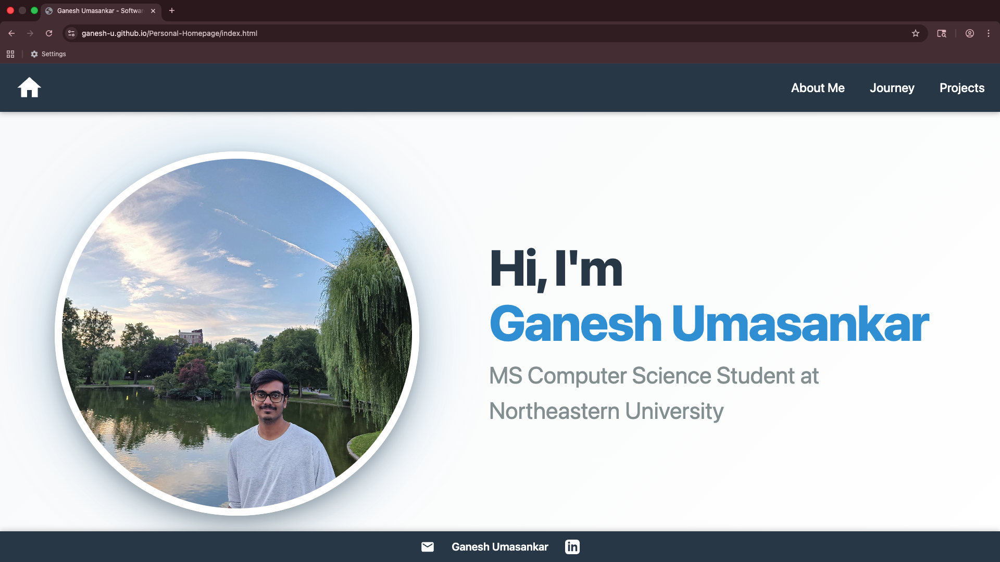
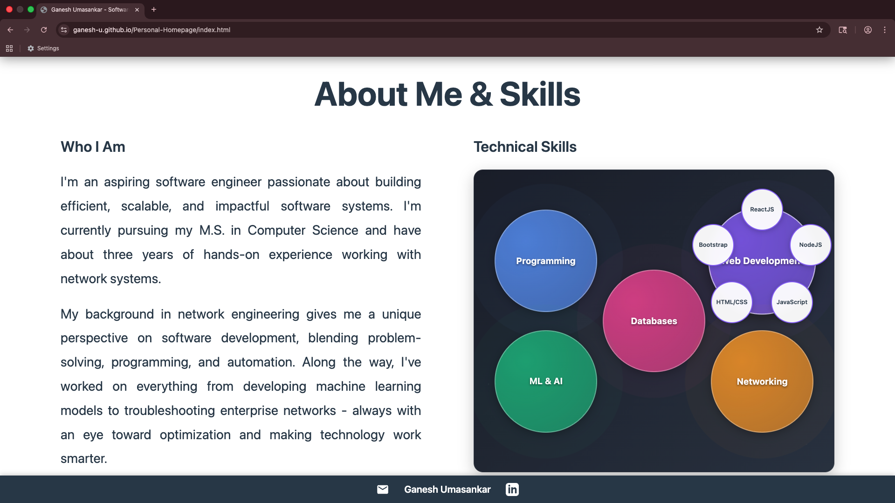
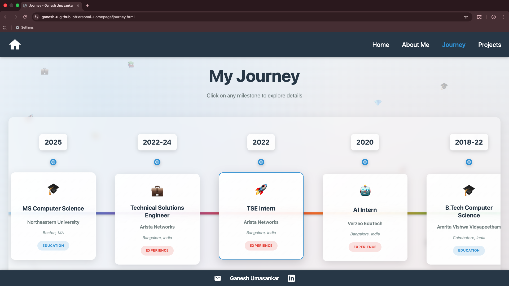
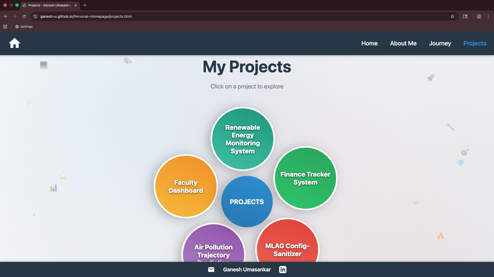

# Ganesh Umasankar - Personal Homepage

A modern, interactive personal homepage showcasing technical skills, professional journey, and academic projects through creative visualizations and engaging user experiences.

## Objective
- Present technical expertise through interactive visualizations
- Showcase academic and professional projects with detailed descriptions
- Provide an engaging timeline of educational and career milestones
- Demonstrate web development skills through creative UI components
- Serve as a professional resource for recruiters and employers

## Screenshots

### Homepage

*Interactive skills constellation with expandable categories and smooth animations*

### About-Me Section

*Interactive skills constellation with expandable categories and smooth animations*


### Journey Page - Horizontal Timeline
 
*Scrollable career timeline with expandable milestone cards*

### Projects Page - Circular Menu System

*Rotating circular project menu with detailed popup modals*


## Creative Addition

### Interactive Skills Constellation
The homepage features a unique **space-themed skills visualization** where technical competencies are represented as celestial bodies in an interactive constellation:

- **Visual Design:** Skills appear as glowing nodes with pulsing animations and particle effects
- **Interactivity:** Click on main skill categories (Programming, Web Development, etc.) to expand and reveal specific technologies
- **Technical Implementation:** Uses mathematical positioning with trigonometry for precise circular layouts
- **User Experience:** Smooth CSS animations with hover effects and expandable sub-skill nodes

This creative addition goes beyond traditional skill lists to provide an engaging, memorable way for visitors to explore technical expertise.

## Technology Requirements

### Core Technologies
- **HTML5:** Semantic markup with modern standards
- **CSS3:** Grid, Flexbox, animations, and responsive design
- **JavaScript ES6+:** Modern syntax with module system
- **ES6 Modules:** Modular architecture with `type="module"`

### Development Tools
- **Prettier:** Code formatting and consistency
- **ESLint:** JavaScript linting and quality assurance
- **W3C Validator:** HTML validation compliance
- **GitHub Pages:** Deployment and hosting platform

### Browser Support
- Modern browsers supporting ES6+ features
- Chrome 60+, Firefox 55+, Safari 11+, Edge 16+
- Mobile browsers with touch interaction support

## Installation & Usage

### Prerequisites
- Node.js and npm (for development tools)
- Modern web browser
- Git for version control

### Local Development Setup
```bash
# Clone the repository
git clone https://github.com/ganeshumasankar/portfolio.git
cd portfolio

# Install development dependencies
npm install

# Start local development server
npm start
# Server will run on http://localhost:8080

# Alternative: Use any local server
# python -m http.server 8080
# or use Live Server extension in VS Code
```

### Development Commands
```bash
# Format code with Prettier
npm run format

# Run ESLint for code quality
npm run lint
npm run lint:fix

# Validate HTML structure
npm run validate

# Development with auto-reload
npm run dev
```

### Project Structure
```
portfolio/
├── index.html              # Homepage with skills visualization
├── journey.html            # Interactive career timeline
├── projects.html           # Circular project showcase
├── css/
│   └── styles.css          # Comprehensive styling (2000+ lines)
├── js/                     # ES6 Modules
│   ├── main.js            # Homepage initialization
│   ├── skills.js          # Skills constellation logic
│   ├── journey.js         # Timeline interactions
│   ├── projects.js        # Circular menu system
│   └── navigation.js      # Shared navigation component
├── images/
│   ├── profile.jpeg       # Professional headshot
│   └── favicon.ico        # Site icon
├── screenshots/           # Documentation images
├── package.json           # Project configuration
└── README.md              # This file
```

## Key Features

### Homepage
- **Hero Section:** Professional introduction along with image
- **Interactive Skills Constellation:** Space-themed skill visualization with expandable categories
- **Responsive Design:** Optimized for desktop, tablet, and mobile devices
- **Smooth Animations:** CSS transitions and hover effects throughout

### Journey Page
- **Horizontal Timeline:** Scrollable career progression with key milestones
- **Expandable Cards:** Click to reveal detailed information about each experience
- **Visual Elements:** Gradient timeline with floating background animations
- **Touch Support:** Mobile-friendly scrolling and interactions

### Projects Page  
- **Circular Rotating Menu:** Projects arranged in a continuously rotating circle
- **Interactive Popups:** Detailed project information in modal overlays
- **Hover Effects:** Pause rotation and scale effects on interaction
- **Technology Tags:** Color-coded technology stack indicators

### Shared Components
- **Responsive Navigation:** Mobile hamburger menu with smooth animations
- **Professional Footer:** Contact information and social links
- **Consistent Styling:** Unified design system across all pages
- **Accessibility:** Semantic HTML, alt tags, and keyboard navigation


### **Creative Features Highlighted**
- **Interactive Skills Constellation:** Space-themed visualization with mathematical positioning
- **Rotating Project Menu:** Circular navigation with trigonometric calculations  
- **Horizontal Timeline:** Unique career journey presentation with smooth scrolling

## Author

**Ganesh Umasankar**  
MS Computer Science Student  
Northeastern University, Boston, MA  

- **Portfolio Website:** [https://ganeshumasankar.github.io/portfolio](https://ganesh-u.github.io/Personal-Homepage/)
- **Email:** umasankar.g@northeastern.edu
- **LinkedIn:** [ganesh-umasankar-87a3371b4](https://www.linkedin.com/in/ganesh-umasankar-87a3371b4/)
- **GitHub:** [ganeshumasankar](https://github.com/Ganesh-U)

## Academic Reference

**Course:** CS5610 - Web Development  
**Institution:** Northeastern University  
**Semester:** Spring 2025  
**Course Website:** [https://johnguerra.co/classes/webDevelopment_spring_2025/](https://johnguerra.co/classes/webDevelopment_spring_2025/)

## Documentation & Resources

### Project Documentation
- **Design Document:** [Design Documentation](docs/design-document.pdf)
- **Video Demo:** [Portfolio Walkthrough](https://youtube.com/watch/demo-video)
- **Live Website:** [Portfolio URL](https://ganesh-u.github.io/Personal-Homepage/)
- **Source Code:** [GitHub Repository](https://github.com/Ganesh-U/Personal-Homepage)

### Technical Resources
- **W3C Validation:** All HTML pages pass W3C validation
- **ESLint Config:** Using class-standard linting configuration
- **Prettier Config:** Consistent code formatting across project
- **Accessibility:** WCAG compliant with semantic markup

## Use of Generative AI

### AI Tools Used
- **Claude (Anthropic):** Version 4 Sonnet
- **Assistance Scope:** Code optimization, design documentation, and debugging support

### Specific AI Assistance
1. **CSS Animation Debugging:** Helped resolve complex positioning issues in the circular menu system and optimized performance for mobile devices
2. **JavaScript Optimization:** Provided suggestions for performance improvements in the skills visualization and responsive design implementation
3. **Documentation Creation:** Assisted with structuring comprehensive README documentation and design document formatting
4. **Code Review:** Helped identify potential improvements in ES6 module organization and best practices implementation

### Prompts Used
- "Help me optimize circular positioning math for the rotating project menu to work consistently across different screen sizes"
- "Review this CSS animation code for better performance on mobile devices and suggest alternatives"
- "Create comprehensive documentation structure for an academic portfolio project including all required sections for CS5610"
- "Debug responsive design issues with circular layouts and suggest solutions for maintaining proportions across devices"


## License

This project is licensed under the MIT License - see the [LICENSE](LICENSE) file for details.

---

**Built with ❤️ by Ganesh Umasankar for CS5610 Web Development**

